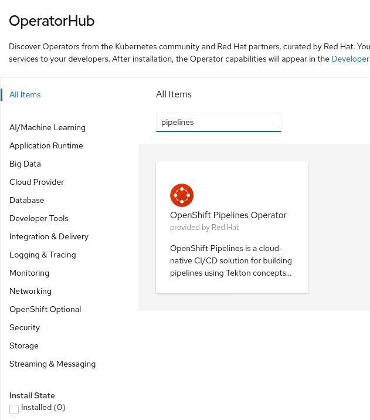
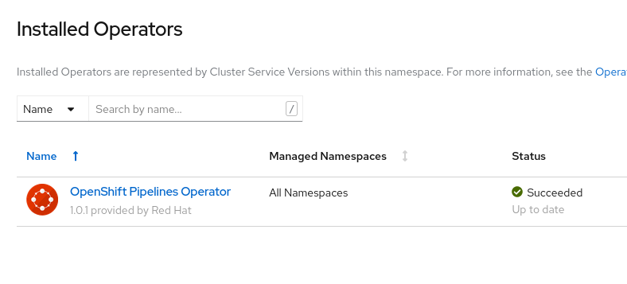
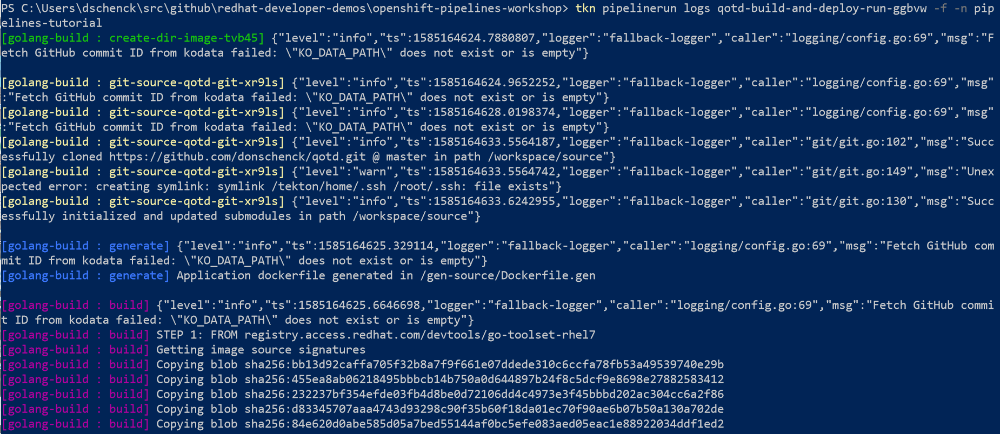

## Workshop to demonstrate OpenShift Pipelines (featuring Tekton).

**All** are welcome: Linux, macOS and Windows.  
**Development Languages supported in this workshop**:
* Go
* Node.js
* C#
* Python

## Description
This workshop will guide you through the creation, execution and ongoing use of Tekton with OpenShift Pipelines, a CI/CD instance that runs in an OpenShift cluster. You will learn how OpenShift Pipelines are installed, how they are configured, how they are run, how to handle the results, and how to continue a development cycle using this CI/CD environment.

## Table Of Contents
* [Introduction](#Introduction)
* [Prerequisites](#Prerequisites)
* [Workshop](#Workshop)
* [Optional Steps](#Optional)
* [Conclusion](#Conclusion)

## Introduction
Delivering working code is the goal of software developement. Undelivered code is worthless; we need to get bits into production. It is sometimes easy to lose sight of this given the distractions of new technologies, the latest methodologies, changing frameworks, etc. In the end, however, it's about working code running in production. In this workshop we'll start with a fresh, new OpenShift cluster and finish with an automated CI/CD system -- Tekton with OpenShift Pipelines -- running in that cluster. Here, in one place: An end-to-end story.

As an optional step, we will then move forward, using the automated CI/CD system as we update and push source code. This will complete the cycle of creating source code, updating source code, and updating the compiled bits that are running in an OpenShift pod.

The engine for this is OpenShift Pipelines. OpenShift Pipelines relies on Tekton, the container-based build component of Knative, and runs in pods. Because each step runs in it's own pod, the benefits include scaling and the ability to run steps in parallel.

This example will give you the choice of using code written in Go, Node.js, C#, or Python. A simple RESTful service, Quote Of The Day, will return quotes via an HTTP GET request.

Here's an example of a cURL command against the service (this is PowerShell):

Note: While the screen captures in this document are based on PowerShell, rest assured that everything here works equally well in a bash shell.

## Prerequisites
The following is a list of the environments and/or tools are necessary to perform this workshop. Details about each follow this list.
1. A terminal session on your PC
1. OpenShift version 4.3 (or newer) cluster
1. Tekton command line interface (CLI), `tkn`
1. OpenShift CLI, `oc`
1. Git
1. Git repo at https://github.com/redhat-developer-demos/openshift-pipelines-tutorial.git. You'll need to clone or download this repo to your machine in order to run the commands contained in this workshop.

### Prerequisite #1: A terminal session on your PC
You'll need to be able to run commands at the command line on your PC. Note that this workshop works with Linux and macOS (bash or PowerShell) and Windows (PowerShell). Where any differences between bash and PowerShell occur in this workshop, commands for both environments will be supplied.

*Yes, PowerShell runs on Linux and macOS.*

### Prerequisite #2: OpenShift version 4.3 (or newer) cluster
An OpenShift 4.3 (or newer) cluster is necessary to run this workshop. Options include:
* CodeReady Containers (CRC) **which is zero cost and runs on your local machine**.
* Amazon Web Services (AWS)
* Microsoft Azure
* Google Cloud
* vmware vSphere
* Red Hat OpenStack Platform
* Red Hat Virtualization
* IBM Z IBM LineONE
* Power Systems
* Bare metal

Visit the [OpenShift 4 web site at try.openshift.com](try.openshift.com) for instructions for your selected cloud-based infrastructure.

Visit the [CodeReady Containers web site](https://developers.redhat.com/products/codeready-containers) for instructions regarding CodeReady Containers.

### Prerequisite #3: Tekton command line interface (CLI), `tkn`
The Tekton CLI, `tkn`, is necessary. Note that this utility is built for your operating system of choice.

To install tkn, visit [the Tekton Pipelines cli github repo](https://github.com/tektoncd/cli#getting-started) and follow the instructions for your operating system.

### Prerequisite #4: OpenShift CLI, `oc`
The OpenShift CLI, `oc`, is necessary. Note that this utility is built for your operating system of choice.

To install oc, visit [the OpenShift version 4 clients download page](https://mirror.openshift.com/pub/openshift-v4/clients/ocp/latest/) and download the client for your operating. You'll need to decompress the downloaded file and make sure the resulting executable bits are in your system PATH variable.

### Prerequisite #5: Git
You'll need the Git tool installed on your machine. You can find the instructions at www.git-scm.com.

### Prerequisite #6: Git repo at https://github.com/redhat-developer-demos/openshift-pipelines-tutorial.git  

You will need the Git repo associated with this workshop.

`git clone https://github.com/redhat-developer-demos/openshift-pipelines-tutorial.git`

After cloning this repo, move into the directory where it is located (typically "openshift-pipelines-tutorial"). This will be the home directory for the remainder of this workshop.

## NOT Prerequisites  

It's worth noting here what you *do not* need to install. You do not need:
* Go language support
* Python language support
* C# (.NET Core) support
* Node.js support
* Make, MSBuild or any other build tools

This is because all the build and deploy work is done in our OpenShift cluster. In fact, once the pipeline is built, you could do all your development work using [CodeReady Workspaces](https://developers.redhat.com/products/codeready-workspaces/overview) on, say, a Chromebook.

## Workshop
The following list shows the seven steps that will be used to get our CI/CD pipeline up and running:
1. Create a project
1. Install operator
1. Create Pipeline
1. Create Tasks
1. Create Pipeline Resources
1. Run the Pipeline
1. View the results

  
 

<h4>Operators and Subscriptions Explained</h4>  

Because OpenShift is built on Kubernetes, it supports the concept of "Operators", or pre-built Customer Resource Descriptions (CRD) that include the sometimes many pieces needed to invoke and sustain a solution. In other words, a Kubernetes Operator can be used to start and maintain a complex solution. For example, there is a Kubernetes Operator that allows you to very easily get an instance of MongoDB running in your OpenShift cluster. There are others: Eclipse Che, Elasticsearch, Kafka, and dozens more.  

To invoke an operator *may* involve many steps. You install the Operator and the create a Subscription. In some cases, such as Kafka, you then invoke the API you want. For example, Kafka Connect or Kafka Topic.
  
For OpenShift Pipelines, one quick command will give us all we need.

### Workshop Step 0: Log in
Before any work can begin, you must be logged into your OpenShift cluster with cluster-admin rights. Use the `oc login` command to do this. For example, on my Fedora 32 machine using CRC:

`oc login -u kubeadmin -p 8rynV-SeYLc-h8Ij7-YPYcz https://api.crc.testing:6443`  

### Workshop Step 1: Create a project
Create an OpenShift project in which we'll be working.  

`oc new-project pipelines-tutorial`

Example:

### Workshop Step 2: Install operator
When it comes to installing the OpenShift Pipelines Operator, you have two choices: Use the web UI dashboard or use the command line. For this workshop, we'll be using the cluster dashboard.

After selecting the OperatorHub option from the menu on the left, type in the word "pipelines" to filter the results. You'll see the Red Hat OpenShift Pipelines operator card.

When you click on the card, you will be prompted to start the installation process:

After you click the Install button, you will be prompted to provide details for the installation. Use the default values and click Install. The installation will execute:

The installation is complete when the status shows "Succeeded":

### Workshop Step 3: Create pipeline  
The next step is to create the pipeline we want to use. The following pipeline is discussed following this image, which is in the file "qotd-pipeline.yaml" in the repository:

#### Line 4: name

This is the name assigned to the pipeline. This name *does not* need to match the name of the file used to create this pipeline. In fact, in this particular example, the file is named "qotd-pipeline.yaml" while the pipeline, *inside of your OpenShift cluster*, is named "qotd-build-and-deploy". It is probably a good idea to make the names match; this is a management issue.

#### Lines 6 through 10: resources

This pipeline uses two resources: A git repo as the input and a Linux container as the output. That is to say, it will clone a git repo and build an image.

Note that the resource _names_ are *not* the same thing as the resource *values*. In our example, the git repo resource name is "qotd-git", but that has no value. Later, when we create this resource, we'll give it a value, i.e. a URL that points to the repo.

#### Lines 12 through 36: tasks

This section declares what is done and in what order.

Line 13 is a name that we've assigned; it could just as well be called 'foo'. The "taskRef", in lines 14 through 16, is where we call out exactly what to do and where to find it. 

The name "buildah" (line 15) is a built-in *ClusterTask* (line 16), a task that is built into the OpenShift Pipelines. You can see this and all the other ClusterTasks by running the command `tkn clustertask ls`. A ClusterTask is available across *all* namespaces in the OpenShift cluster, while tasks that we have created are limited to the namespace in which they are created.

I'm using buildah to build the image. Since I have the file "Dockerfile" in my source code, this is an excellent choice. I can use the Dockerfile while developing and testing on my local machine, and then when I push the source to the git repo and use it in my pipeline, I can be assured the same build steps and resulting image will be used. I'm in control, and I like that.

 How to we know what resources the "buildah" ClusterTask needs? We can run the command `tkn clustertask describe buildah` to see the details. in the following you can see the input and output resources.

Output from `tkn clustertask describe buildah`:  

  

In line 30 we declare a task that we created (creating a Task happens later in this workshop). Notice line 36, which specifies that this task runs only *after* the task "image-build" is completed.

With that knowledge, let's create the pipeline:

#### Command to create the pipeline  

`oc create -f qotd-pipeline.yaml`

Example:
  

### Workshop Step 4: Create tasks  

After our pipeline builds the image and places it into the OpenShift project's registry, the only task we need to create in our namespace is the "apply-manifests" task. As good fortune would have it, we don't even need to create this from scratch. It's a part of the OpenShift Pipelines catalog, a collection of open source, reusable tasks. The catalog can be found at https://github.com/openshift/pipelines-catalog.

Here is the command to create the "apply-manifests" task:  

`oc create -f apply_manifest_task.yaml`

The "apply-manifests" task will find the YAML files in the git repo's "k8s" directory and apply them to our application. Knowing this, our source repos will have a "k8s" directory with three manifests: a Deployment Config, a Service, and a Route. You can view these by looking in the source repos:

* https://github.com/redhat-developer.demos/qotd.git
* https://github.com/donschenck/qotd-csharp.git
* https://github.com/donschenck/qotd-python.git
* https://github.com/donschenck/qotd-nodejs.git

The files in the "k8s" directory will create a deployment for our application, create a service that points to the deployed pod, and a route that allows you to access the service from outside of your cluster. If these we not created, the pipeline would simply create an imagestream and nothing more. There may be cases where this is desired, such as creating an image and pushing it to a public image registry such as quay.io.

### Step 5: Create pipeline resources  

We need to create two resources. The names must match the resources specified in the pipeline: qotd-git and qotd-image.  

* qotd-git - defines the location of the github repo containing the source code to be compiled into an image
* qotd-image - defines the location of the created image

Note that the *name* of the resource, the *file name* of the YAML file describing the resource, and the *value* of the resource are in no way related. In fact, we have four different YAML files in the repo that all do the same thing: Create a resource named "qotd-git". They each have a different value.

You can view this by looking inside the following four files:
* qotd-git-csharp-resource.yaml
* qotd-git-go-resource.yaml
* qotd-git-python-resource.yaml
* qotd-git-nodejs-resource.yaml

As you might suspect, each is written in a different programming language; they all give the same results.

You *can* create a ressource by running the command `tkn resource create` and following the prompts, but we're going to use the command line and a YAML file; it's much more "DevOps"-y.

Choose any of the four qotd-git-* YAML files and create the "qotd-git" resource:

`oc create -f qotd-git-go-resource.yaml`

In the repo, we have two YAML files that will create the resource "qotd-image": One points to the cluster's internal image registry, while the other writes the image to quay.io. For this workshop, we'll be using the internal registry. Run the following command to create the resource "qotd-image":

`oc create -f qotd-image-pipelineresource.yaml`

We can view the results by running `tkn resource ls`  

### Workshop Step 6: Run pipeline  
At this point, we have a pipeline, tasks that make up the pipeline, and resources to be used by the build. We can see what we have by running some commands.

`tkn task ls` to see a list of tasks:

Example:

`tkn pipleline ls` to see a list of pipelines:

Example:

Now what we have the name of the pipeline, we can start it. After it is started, the terminal will return the command you will use to watch the progress of the build.

When you are prompted for the resources to use, use the default values.

`tkn pipeline start qotd-build-and-deploy`

Example:

### Workshop Step 7: View results  

`oc get routes`

Use the route in your browser, or run the cURL command in your terminal, to navigate to the results. Refresh your browser several times to see random results.

Valid routes include:  
"/"  
"/writtenin"
"/version"  
"/quotes"  
"/quotes/random"  
"/quotes/0"  
"/quotes/1"  
"/quotes/2"  
"/quotes/3"  
"/quotes/4"  
"/quotes/5"  

Example:  
`curl http://qotd-pipelines-tutorial.apps-crc.testing/quotes/random`

### Workshop Optional Step 8: Make changes and see results

In this optional step, the git repo location is changed and the pipeline is started. This will result in a different image being run. This change can be observed by running a `cURL` loop and watching the results.

What we will do is change the value of the Pipeline Resource "qotd-git" to point to a differnet Github repo.

Start by running the cURL command at the command line:

(bash)  
`while true; do sleep 1; curl <<your route here>>/writtenin; curl <<your route here>>/quotes/random; done`

(PowerShell)  
`While($true) { $(curl <<your route here>>writtenin).Content; $(curl <<your route here>>/quotes/random).Content; sleep 1 }`

A bash shell example:  

`while true; do sleep .25; curl http://qotd-pipelines-tutorial.apps-crc.testing/writtenin; curl http://qotd-pipelines-tutorial.apps-crc.testing/quotes/random; done`

You could choose the `oc patch...` command to update your qotd-git resource, but instead it's much easier to simply apply changes from a different YAML file.

**Any one** of the following commands will work; choose the one that is *not* the language you are currently using (Go if you're following this tutorial to the letter):

`oc apply -f qotd-git-csharp-resource.yaml`  
`oc apply -f qotd-git-go-resource.yaml`  
`oc apply -f qotd-git-python-resource.yaml`  
`oc apply -f qotd-git-nodejs-resource.yaml`  

Run the following command to re-run the pipeline:  
`tkn pipeline start qotd-build-and-deploy --last`

This will start the pipeline using the new value for the source code Github repo.

After a few minutes you should see the results of your cURL loop change.

This marks the end of this workshop.
